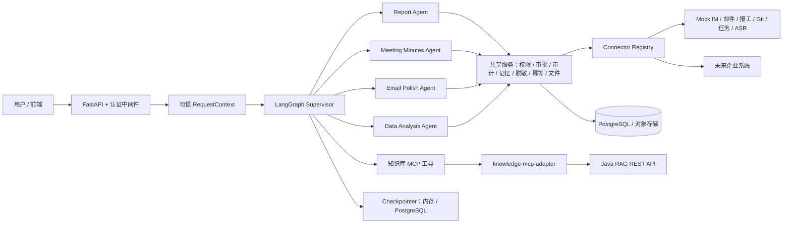

# 企业内部 Multi-Agent 办公智能助手：阶段一架构设计

> 状态：待架构确认；本阶段不生成完整业务实现。  
> 更新时间：2026-07-28

## 1. 目标与边界

本项目提供一个可审计、可恢复、可逐步接入企业系统的办公助手。首个可运行闭环以 Mock 实现：生成日报草稿 → 人工审核 → 幂等提交 Mock 报工系统；并覆盖会议纪要、邮件润色、文件分析与知识库查询的最小闭环。

系统采用“Supervisor + 专业子 Agent + 确定性工具 + Connector + 共享服务”架构。Agent 只负责理解、计划、抽取、归类和生成；权限、审核、幂等、外部写操作、审计和数据校验全部由后端确定性代码强制执行。

Java RAG 不在本项目中重复实现。它将由独立的 `knowledge-mcp-adapter` 通过 MCP 工具访问既有 Java REST API。

## 2. 官方实现选择与版本策略

已核对当前官方文档后，建议采用下列方式：

| 范畴 | 决策 | 原因 |
|---|---|---|
| 编排 | 原生 `StateGraph` | 对审批中断、可见状态和确定性工作流有精确控制。 |
| 专业 Agent | `langchain.agents.create_agent` 后包装为受限工具，或在需要状态可见性时作为子图节点 | 官方的 subagent-as-tool 模式能隔离上下文；审批中的子图需以节点调用，保留状态可见性。 |
| HITL | `interrupt()` + `Command(resume=...)` | 以 `thread_id` 恢复，并通过 checkpointer 保存中断点。中断节点必须保证中断前副作用幂等。 |
| 本地/生产检查点 | `InMemorySaver` / `PostgresSaver` | 开发免基础设施，生产可恢复。 |
| MCP 服务 | 官方 Python SDK 的 `FastMCP`，生产采用 Streamable HTTP | 使用官方 Tier-1 Python SDK；身份只从受信任请求上下文注入。 |
| 模型 | 由 `BaseChatModel` 注入 | 业务代码不绑定具体模型厂商。 |

建议在 `pyproject.toml` 使用兼容上限，首次实现时由锁文件解析成精确版本。例如：`python >=3.11,<3.13`、`langgraph >=1.1,<2`、`langchain >=1.0,<2`、`mcp >=1.27,<2`、`fastapi >=0.115,<1`、`pydantic >=2.10,<3`、`sqlalchemy >=2.0,<3`、`httpx >=0.27,<1`、`pytest >=8,<9`。实施时会以实际安装测试结果生成锁文件；避免预先声称某一未安装版本可用。

参考：LangChain [Subagents](https://docs.langchain.com/oss/python/langchain/multi-agent/subagents)、[Agents](https://docs.langchain.com/oss/python/langchain/agents)；LangGraph [Interrupts](https://docs.langchain.com/oss/python/langgraph/interrupts)、[Memory](https://docs.langchain.com/oss/python/langgraph/add-memory)；MCP [官方 SDK 列表](https://modelcontextprotocol.io/docs/sdk)、[Python SDK](https://github.com/modelcontextprotocol/python-sdk)。

## 3. 总体架构



### 调用与信任边界

1. 认证中间件构造 `RequestContext`，而不是从模型工具参数读取租户、员工、权限或 Token。
2. Supervisor 只拿到任务摘要、引用和必要偏好；原始大文件、录音全文、邮件全文和知识库片段停留在受控服务中。
3. 子 Agent 输出必须解析为 Pydantic 模型；校验失败最多重试有限次数，随后返回结构化失败。
4. 任何写操作均按“草稿 → 业务校验 → 权限 → 审批策略 → 幂等 → Connector 写入 → 回查 → 审计”执行。Supervisor 没有绕过该链路的权限。
5. 未审核的模型推测、草稿邮件和草稿纪要不得写入长期记忆。

## 4. 核心状态与 Schema

### 4.1 可信请求上下文

```python
class RequestContext(BaseModel):
    request_id: UUID
    thread_id: str
    tenant_id: str
    operator_id: str
    employee_id: str | None
    department_id: str | None
    role_ids: list[str]
    permission_scopes: set[str]
    locale: str = "zh-CN"
    timezone: str = "Asia/Shanghai"
    trace_id: str
```

该对象仅由中间件/作业调度器创建，并通过依赖注入或运行时上下文传入服务和 Connector；禁止出现在 LLM 可填写的 Tool 输入模型中。

### 4.2 Supervisor State（只保存摘要和引用）

```python
class AssistantState(TypedDict, total=False):
    request: UserRequest                 # 用户意图与显式参数
    context_ref: str                     # 可信上下文引用，不含 Token
    intent: Intent
    plan: list[PlanStep]
    task_status: TaskStatus
    artifact_refs: list[ArtifactRef]
    evidence_refs: list[EvidenceRef]
    subagent_results: dict[str, AgentResult]
    approval: ApprovalSnapshot | None
    warnings: list[WarningItem]
    errors: list[ErrorItem]
    retry_count: int
    result: FinalResponse | None
```

共用枚举包括：`Intent`（提示词列出的 14 个意图）、`TaskStatus`、`ApprovalStatus`、`SourceType`、`Sensitivity`、`SubmissionPolicy`。所有正式结果的事实字段均携带 `EvidenceRef`（来源类型、来源 ID、受控 URL/对象键、片段 ID、可信度）。

### 4.3 专业 Schema 摘要

| Agent | 输入引用 | 核心输出 | 强制规则 |
|---|---|---|---|
| Report | 日期范围、数据源引用、手工补充 | `WorkEvent`、`ReportDraft`、`SubmissionDecision` | 计划不等于完成；正式事实关联事件证据；默认人工提交。 |
| Meeting | `meeting_id`、录音/转写引用 | `TranscriptSegment`、`MeetingMinutes`、`ActionItem` | 决策和行动项关联 `segment_id`；不猜测负责人、截止日期或说话人。 |
| Email | 草稿与有限线程引用 | `PolishedEmailDraft`、`RiskAssessment` | 日期、金额、责任归属不可改变；默认只生成草稿，不发送。 |
| Data | `file_id`、分析规格 | `DataQualityReport`、`AnalysisResult`、`ChartArtifact` | 指标由代码计算；图表追溯源列/过滤器；禁止执行宏或文档指令。 |

## 5. Connector 与服务接口

Connector 是外部系统唯一入口，提供 `Protocol` 接口和 Mock/HTTP 两种实现。所有方法均接收内部业务参数与可信运行上下文，外部鉴权在 Connector 内取得。

| 接口 | 关键方法 | 写操作保护 |
|---|---|---|
| `ReportSystemConnector` | `get_projects`、`get_report`、`submit_report`、`update_report`、`get_report_status` | 幂等键、提交后回查、审计。 |
| `MeetingIMConnector` | `get_meeting`、`get_invited_participants`、`get_actual_participants`、`get_recording` | 读权限、对象引用。 |
| `ASRService` | `submit_transcription`、`get_transcription_status`、`get_transcription_result` | 异步任务、有限重试。 |
| `EmailConnector` | `send_email`、`get_send_status` | 审批、版本 SHA-256、禁止重复发送。 |
| `GitConnector`/`TaskConnector` | 查询 commit、MR、issue、任务 | 只读、来源证据。 |
| `JavaRagClient` | `answer`、`search`、`document_chunk`、`document_metadata` | MCP 身份透传、统一错误与引用。 |

共享服务：`PermissionService`、`ApprovalService`、`AuditService`、`MemoryService`、`SensitiveDataService`、`FileService`、`ArtifactService`、`IdempotencyService`、`DirectoryService`、`ConnectorRegistry`。它们都必须在租户边界内查询。

## 6. 建议目录

```text
office_mult_agent/
├─ app/
│  ├─ api/                 # FastAPI 路由与依赖注入
│  ├─ middleware/          # 认证、RequestContext、追踪
│  ├─ agents/
│  │  ├─ supervisor/       # graph/state/schemas/prompts/routing
│  │  ├─ report_agent/
│  │  ├─ meeting_minutes_agent/
│  │  ├─ email_polish_agent/
│  │  └─ data_analysis_agent/
│  ├─ connectors/          # Protocol、HTTP 实现、mocks/
│  ├─ services/            # 权限、审批、审计、记忆等
│  ├─ models/              # SQLAlchemy ORM
│  ├─ repositories/
│  ├─ schemas/             # 共享 Pydantic 契约
│  ├─ tools/               # 受控 LangChain 工具包装
│  ├─ config.py
│  └─ main.py
├─ knowledge-mcp-adapter/
│  └─ app/                 # FastMCP、JavaRagClient、认证上下文、tools/
├─ migrations/
├─ tests/{unit,integration,fixtures}/
├─ scripts/
├─ docs/
├─ pyproject.toml
├─ docker-compose.yml
├─ Dockerfile
├─ .env.example
└─ README.md
```

## 7. 数据与持久化设计

PostgreSQL 保存工作流与审计元数据；大文件、原始邮件、录音和转写只保存经过授权的对象存储引用。第一批迁移包含：`agent_threads`、`agent_runs`、`audit_logs`、`approval_tasks`、`approval_records`、`work_events`、`reports`、`report_versions`、`report_submissions`、`meetings`、`transcript_segments`、`meeting_minutes`、`email_drafts`、`files`、`analysis_tasks`、`analysis_results`、`chart_artifacts`、`user_memories`、`memory_candidates`、`idempotency_records`。

每个业务表至少含 `tenant_id`、`created_at`、`updated_at`、`created_by`、`version`、`status`；加上 `(tenant_id, id)` 索引和必要的租户复合唯一键。报告提交幂等键为 `tenant_id + employee_id + report_type + report_date + report_version`。

## 8. API 第一版契约

首批实现完整下列入口：

* `POST /assistant/invoke`、`POST /assistant/{thread_id}/resume`、`GET /assistant/{thread_id}/state`
* `POST /reports/generate`、`POST /reports/{report_id}/review`、`POST /reports/{report_id}/submit`
* `POST /meetings/{meeting_id}/minutes`、`POST /meetings/{meeting_id}/reviews`、`POST /meetings/{meeting_id}/send`
* `POST /emails/polish`、`POST /analysis/run`、`POST /files/upload`

其余查询、导出和记忆管理端点在第二至四阶段按提示词的完整清单补齐。每个响应包含 `request_id`、`thread_id`、状态、结构化 warnings/errors、结果引用及证据引用；不返回隐式推理过程。

## 9. 开发计划与验收门槛

1. **阶段一：基础工程（当前为设计，待确认后实施）**：创建 Python 工程、依赖锁定、共享契约、FastAPI 健康检查、基础 Supervisor 图、Connector Protocol 与 Mock；运行烟囱测试。
2. **阶段二：Agent 闭环**：实现四个 Agent 与子 Agent 工具包装；实现日报“生成—审核—幂等提交”及会议纪要/邮件/文件分析的 Mock 流程；单元测试覆盖关键事实规则。
3. **阶段三：知识库 MCP 适配层**：独立 FastMCP 服务、四个工具、`JavaRagClient`、可信身份透传、Mock Java RAG、MCP 集成测试。
4. **阶段四：持久化与记忆**：SQLAlchemy/Alembic、Postgres checkpoint、受确认的长期记忆、版本和产物引用；容器化集成测试。
5. **阶段五：企业级控制**：RBAC/ABAC、HITL、审计、脱敏、文件安全、任务队列与调度；安全和恢复测试。
6. **阶段六：交付**：全量测试、Docker Compose、README、演示脚本、真实系统对接清单和测试报告。

每个阶段的完成条件是：代码审查通过、测试实际运行且结果记录、Mock/真实接口边界清楚、没有将权限或写入控制交给 Prompt。

## 10. 关键假设与待公司提供资料

1. 当前仓库为空，允许从 Python 3.11 项目骨架起建；若已有运行时/CI 约束，需先确认。
2. 本地开发使用 Mock、内存 checkpoint 和本地文件存储；生产使用 PostgreSQL、对象存储和密钥管理服务。
3. 认证上游能提供已验证的用户身份、租户、角色及 scope；否则不能安全执行任何真实系统访问。
4. 真实接入前需要：各系统 OpenAPI/字段字典、认证方式与 Token 生命周期、限流与错误码、回调/轮询协议、数据保留规则、权限矩阵、测试租户与脱敏样本。
5. Java RAG 需要明确 REST 契约、租户/用户身份透传规则、引用格式、错误码和超时/SLA。
6. 文件分析的容量上限、允许格式、病毒扫描器、对象存储和数据留存策略尚待确认。

## 11. 已知限制

当前阶段没有真实企业接口或模型凭据，因此不能宣称已接通真实 IM、邮件、Git、报工、ASR 或 Java RAG；所有未来外部依赖会以 Protocol、Mock 和显式 TODO 交付。审批 UI、任务队列选型（Celery/Arq）及生产可观测平台也将在环境和 SLA 确认后实现。
